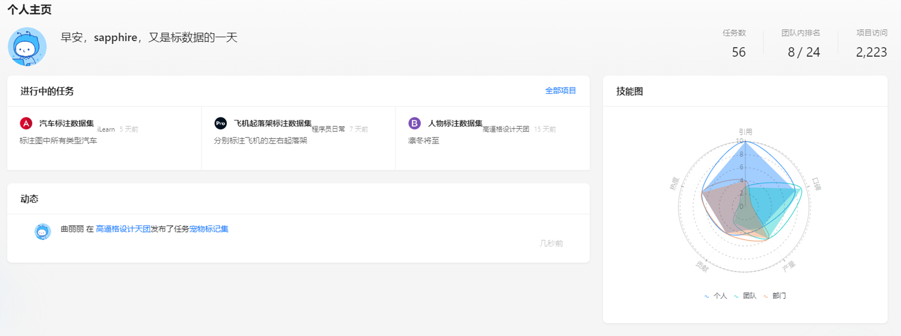
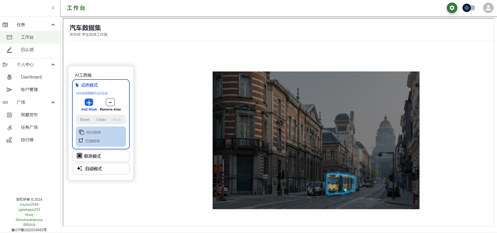
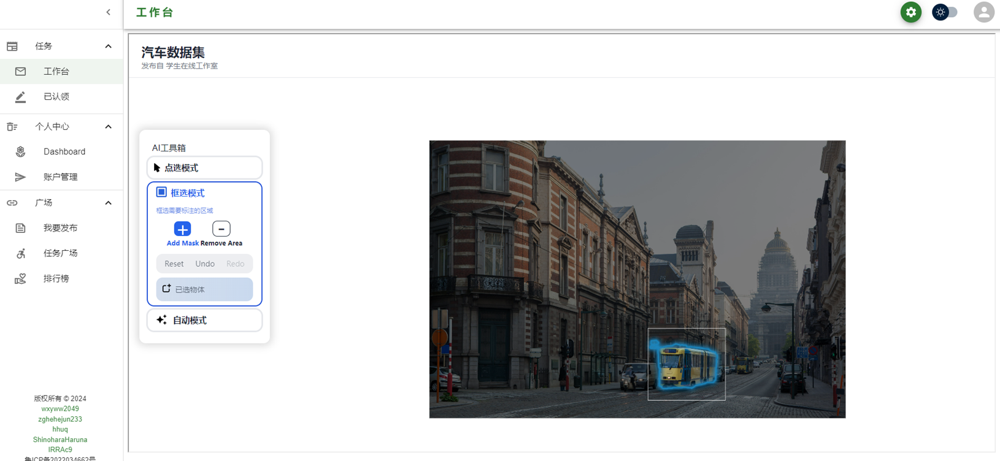
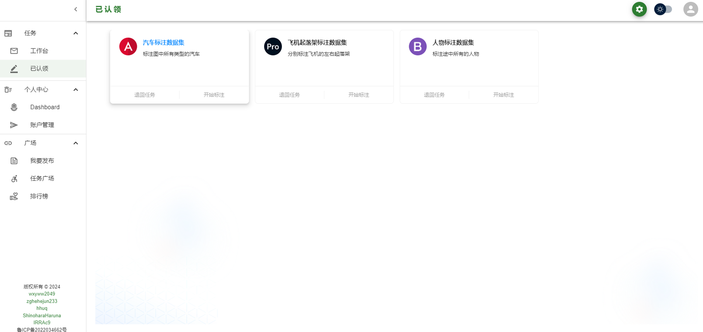
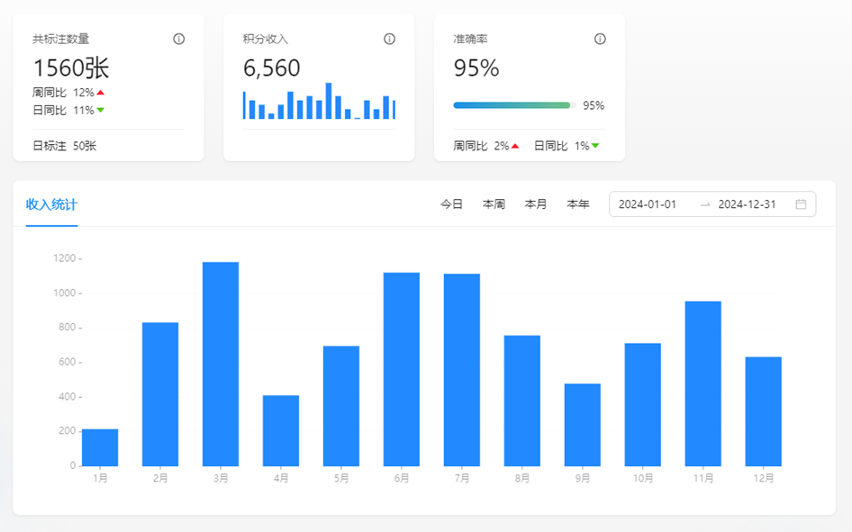

# 前端1 - 确定前端技术路线

## 1 核心需求概述

本系统采取重前端轻后端的实现框架，由于模型大小较小，所以可以使用浏览器提供的onnx运行时进行推理。在模型推理交给前端的前提下，前端的核心需求如下

-  模型推理

-  用户多种输入捕获

-  推理结果展现与格式化

## 2 关键技术

最主要的关键技术为onnx运行时的调试和使用，需要验证onnxruntime-web的全套输入输出链。

以模型的推理为核心，在推理前需要获取图片的npy数据，由于npy的计算对算力要求较高，所以交由后端实现，之间传回前端。

模型的输入还有用户侧的输入，需要验证用户点击、框选两种输入模式下对于模型的调用情况。

在推理后需要对于模型的输出进行处理，一方面，需要形成mask在用户侧进行展示，另一方面，需要将数据化的结果传递给后端。

### 3 原型设计

个人主页：

工作台：

包括三种模式，分别是点选、框选和使用文本自动分割。

平台界面：

数据统计界面：

