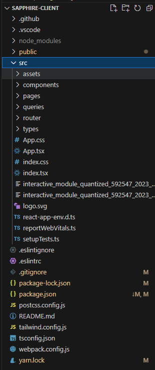
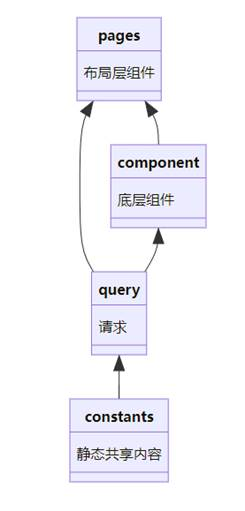

# 前端2 - 搭建前端架构

## 1 前端架构

前端整体采用react + mui构建，异步状态管理使用react-query。对于全局与部分全局状态，使用context进行共享。使用react-router进行路由。

## 2 项目结构树

项目结构树如下图所示：



接下来我们说明每一个文件夹及重要的文件的含义：

```java
sapphire-client
├─ package-lock.json  	// 锁定安装时的包的版本号，确保一致性
├─ package.json  		// 描述项目的元数据和管理项目的依赖
├─ postcss.config.js  	// PostCSS的配置文件，用于转换CSS代码
├─ public				// 存放静态文件，如HTML、图标、图片等
│  ├─ assets  		// 静态资源文件夹，通常用于存放项目中使用的图片、字体文件等
│  ├─ favicon.ico 	// 网站的图标
│  ├─ index.html  	// 主页HTML文件
│  ├─ logo192.png  	// 用于显示在网页标签页的小图标
│  ├─ logo512.png  	// 可用于PWA应用的大图标
│  ├─ manifest.json // PWA应用的配置文件
│  ├─ public.zip  	// 打包的静态资源文件
│  └─ robots.txt  	// 指导搜索引擎爬虫哪些页面可以抓取，哪些不可以
├─ README.md  		// 项目说明文件，通常包含安装、配置、运行等指南
├─ src  			// 源代码文件夹，包含了项目的主要代码
│  ├─ App.css  		// 主应用程序的CSS样式文件
│  ├─ App.tsx  		// 主应用程序组件的TypeScript文件
│  ├─ assets  		// 存放项目中使用的资源，如样式、图片、字体等
│  │  ├─ fonts  	// 字体文件夹
│  │  ├─ manifest.json  // 资源清单文件
│  │  └─ scss  			// 存放SCSS样式文件的文件夹
│  │     └─ App.scss  	// 主应用程序的SCSS样式文件
│  ├─ components  		// 存放React组件的文件夹
│  ├─ index.css  		// 全局样式文件
│  ├─ index.tsx  		// 项目入口文件
│  ├─ logo.svg  		// 项目的SVG格式logo
│  ├─ pages  			// 存放页面组件的文件夹
│  │  ├─ common  		// 存放通用页面组件，如404错误页面
│  │  │  └─ 404.tsx  	// 404错误页面组件
│  │  ├─ consoleboard  	// 控制面板页面组件
│  │  ├─ dataset  		// 数据集页面组件
│  │  ├─ profile  		// 用户个人资料页面组件
│  │  ├─ setting  		// 设置页面组件
│  │  ├─ workdesk   	// 工作台页面组件
│  │  └─ workshop  		// 工作坊页面组件
│  ├─ queries  			// 存放API查询相关代码的文件夹
│  ├─ react-app-env.d.ts  // 声明React应用程序的环境类型
│  ├─ reportWebVitals.ts  // 用于报告网页的性能指标
│  ├─ router  			// 存放路由相关代码的文件夹
│  ├─ setupTests.ts  	// 配置测试环境的文件
│  └─ types  			// 存放TypeScript类型定义的文件夹
├─ tailwind.config.js   // Tailwind CSS的配置文件
├─ tsconfig.json  		// TypeScript的编译配置文件
├─ webpack.config.js  	// Webpack的配置文件，用于模块打包
└─ yarn.lock  			// 锁定安装时的包的版本号，确保一致性

```


## 4 架构模型

1. 数据流：组件间的数据流可以分为全局数据、同级组件间的通讯和父子组件间的通讯。对于全局数据，例如用户id，用户角色，用户token等，需要在刷新后不丢失，对于这类数据使用local storage进行保存。对于同级组件间的通讯，比如用户基本信息、用户角色等会在同级组件之间传递或者需要纳入状态管理的全局数据，使用react Context进行管理，避免了使用redux进行全局状态管理。对于父子组件间的通讯，这是最常见的通讯，使用props进行数据传递。

2. 组件划分：应用整体使用组件化开发，对于可复用的小型组件，纳入component进行管理。对于难以复用的组件，也会进行抽离。这样的优点是使父组件看起来更加简单易于处理布局。对于除管理端外的三端，都使用siderBar组件嵌套内容组件的方式。内容组件使用Grid进行布局管理，便于进行响应式布局。

3. 依赖关系：pages中管理显示布局层组件，component中管理底层组件，constants管理静态共享内容（目前只有URL），query实现不同页面的接口。其依赖关系可以用下图表示

4. 规范：组件名使用双驼峰，hook以use开头，状态使用单驼峰，修改状态使用setStateName，上下文使用nameContext。

