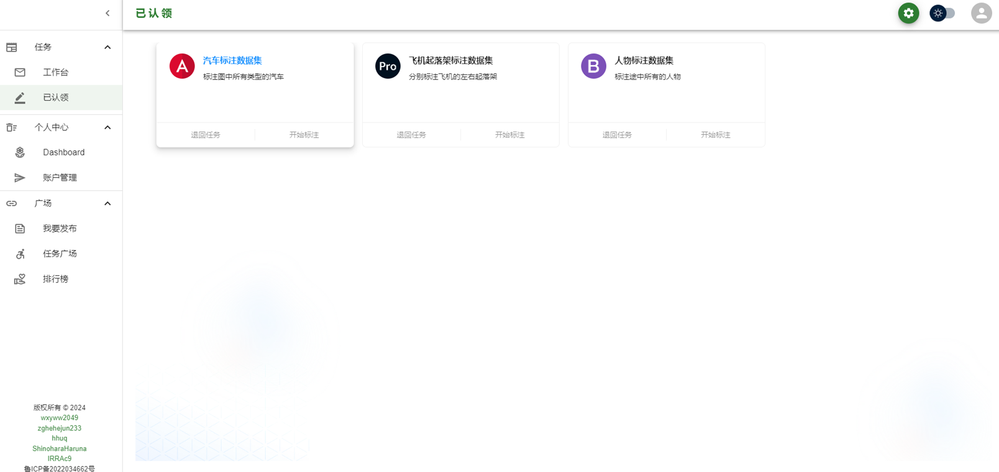
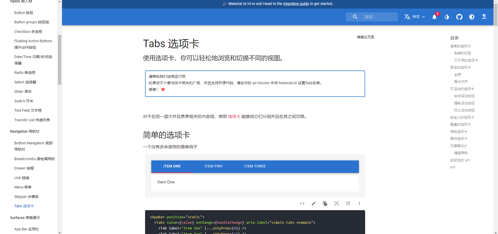
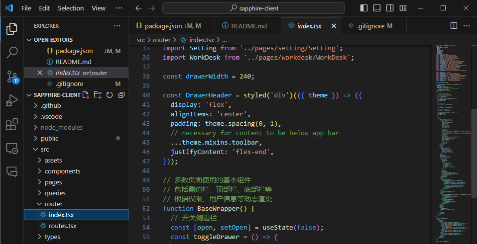
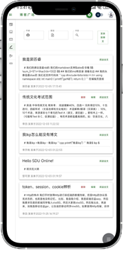

# 前端3 - 前端模块

## 1 导航栏设计

关注用户体验，减少导航深度。大部分页面只使用一级导航。部分页面使用二级导航。使项目整体结构更加分明。提升用户体验。

关注可维护性，组件化开发，将应用的各个部分抽离成二十多个组件，并在不同地方对这些组件进行复用。提升了开发速度。提高了应用的可维护性。对于底层组件的修改可以应用到全部页面。

关注程序性能，使用 react-query进行异步状态管理。react-query会自动对请求进行缓存，未发生变化的请求会默认返回上次请求的内容。从而减少请求次数，提升程序性能。使用上下文进行同级和跨级组件间的沟通，减少组件之间的层层通讯，提升性能。

一个理想中的导航栏界面：

## 2 MUI框架

应用的整体风格全部遵从MUI风格。使用MUI构建整个应用。

MUI 是一个轻量级的前端框架，专注于提供样式一致的基础样式和丰富的组件库。它使用了原生 HTML、CSS 和 JavaScript 来实现组件，并提供了丰富的主题和可定制的样式。MUI 的组件库包括了常用的前端组件，例如导航栏、按钮、卡片、表格等。它的组件也可以很方便地与 React 等框架集成。MUI 的优点在于它轻量级、易于使用，且可以提供一致的样式。

应用的主题色，夜间和日间模式均纳入MUI的调色板管理。便于整体管理。另外MUI提供了一致的样式，看起来整个项目更加统一。

## 3 路由系统

使用react-router进行路由。在根目录route中插入Index组件，并在Index中对用户身份进行核验（检查local storage），从而实现客户端的正确跳转和绑定。

并在路由层级获取用户基本信息保存至全局上下文，从而实现用户信息在各组件的共享。借助以上工作实现了错误地址的重定向。

## 4 响应式页面

前端应用的开发整体使用响应式页面。使用MUI的Grid对布局进行管理。对于不同尺寸的设备会进行不同的展示。例如： 在大屏设备上，页面一般采用两个paper左右排列的形式。但是在窄屏设备上，两个Paper会上下排列，从而实现对于手机端的适配。

