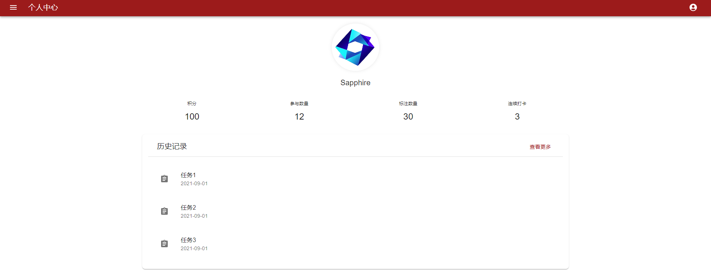
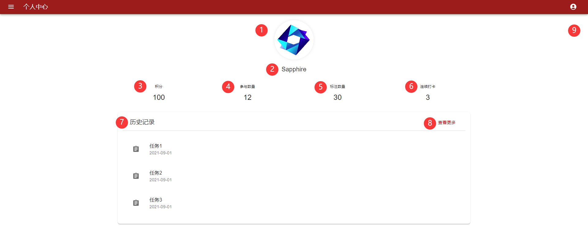
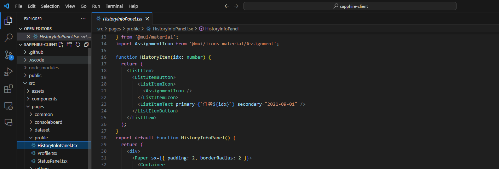
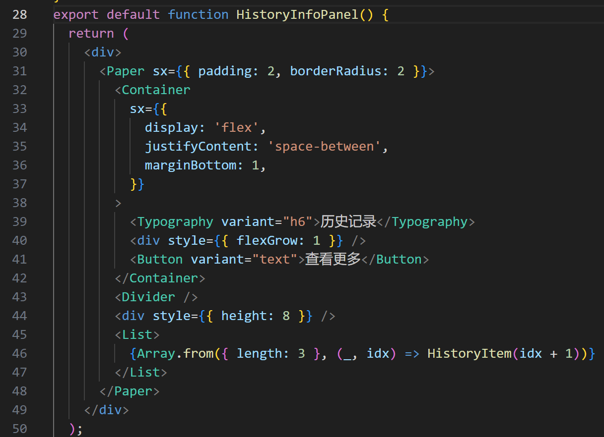

# 前端5 - 个人界面

本周，我的重点工作是实现前端中的个人界面。

## 1 个人界面效果

首先看一下完整的效果截图。目前还只是一个比较初步的版本，后续还会更新界面或使用更加仿真的数据进行展示。

## 2 具体功能描述

为了方便描述本界面的功能，在下图中，我把每一个设计都用序号标注了出来。

**展示功能包括：**①头像  ②昵称  ③积分  ④参与数据集数量  ⑤既往标注的数据集总数  ⑥连续打卡天数  ⑦历史标注的数据集

**交互功能包括：**⑧跳转到所有曾经标注过的数据集，待完善  ⑨右上角跳转至用户主页，待完善

## 3 实现

本项目是使用**React**框架结合**Material-UI**库来编写的。React 负责组件的创建和状态管理，而 Material-UI 提供了一套预定义的 UI 组件和样式，用于构建具有一致设计语言的界面。

一小段代码截图：

这三个文件组合起来，用于构建一个个人主页的用户界面。每个UI组件的功能和实现方式概述如下：

1. `HistoryItem`组件：
   - 功能：显示一个历史记录项。
   - 实现：使用`ListItem`和`ListItemButton`来创建可点击的列表项，`ListItemIcon`和`AssignmentIcon`显示一个图标，`ListItemText`显示任务名称和日期。
   
2. `HistoryInfoPanel`组件：
   - 功能：显示一个包含多个历史记录项的面板。
   
   - 实现：使用`Paper`和`Container`来布局，`Typography`显示标题，`Button`提供查看更多的选项，`List`渲染多个`HistoryItem`组件。
   
     
   
3. `StatusItem`组件：
   - 功能：显示一个状态信息项，如积分、参与数量等。
   - 实现：使用`Stack`来垂直排列标题和数值，`Typography`显示文本，通过`&:hover`添加鼠标悬停效果。
   
4. `StatusPanel`组件：
   - 功能：显示一个包含多个状态信息项的面板。
   - 实现：使用`Stack`水平排列多个`StatusItem`组件。
   
5. `Profile`组件：
   - 功能：整合`StatusPanel`和`HistoryInfoPanel`，并添加用户头像和名称。
   - 实现：使用`Grid`和`Container`进行布局，`Avatar`显示用户头像，`Typography`显示用户名称。

因为之前没有接触react，本次主要想拓宽一下技术栈，因此在编写过程中遇到了许多大大小小的问题。最终呈现出来的效果也比较简朴，期望未来可以加上更多功能。
