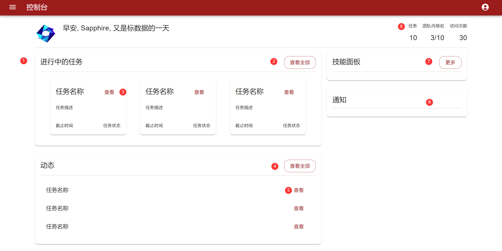
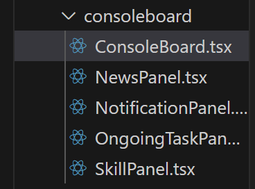
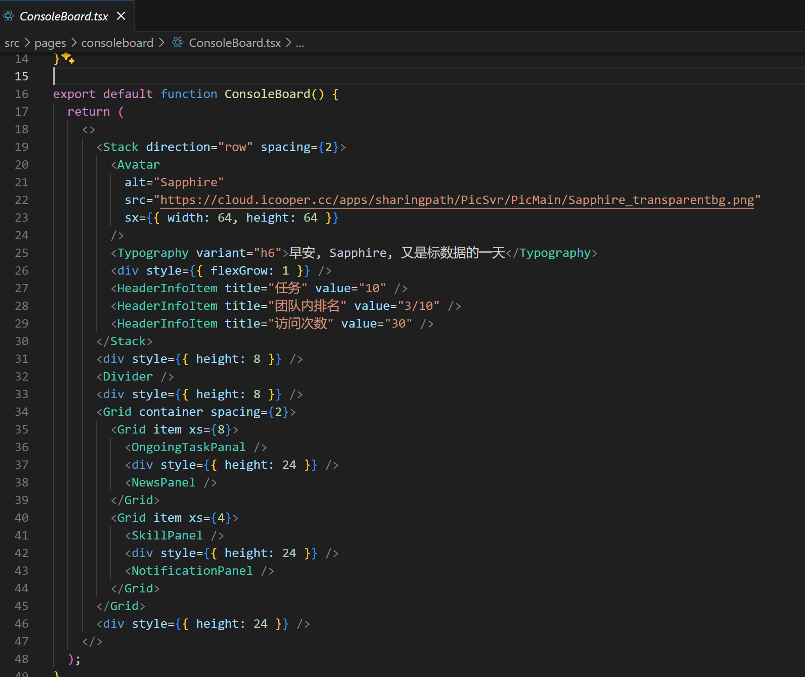
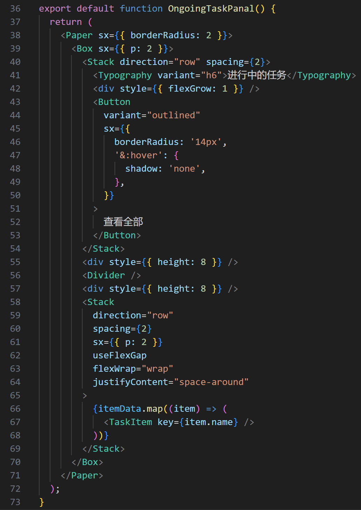
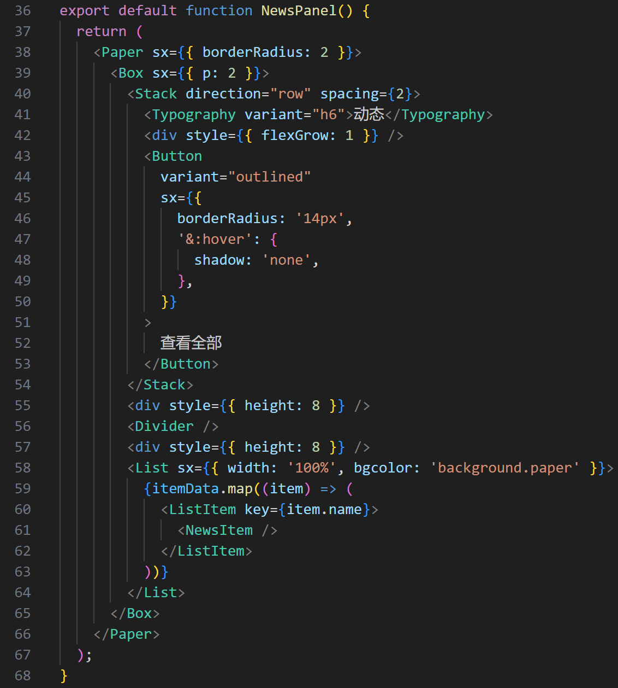

# 前端6 - 控制台

本周，我将控制台的前端界面基本绘制完成。

## 1 效果及其功能

这是本次实现的界面截图，序号用于标示本页面功能点：

- 进行中的任务：①进行中的任务集合，包括若干任务小组件，最多显示3个；②点击“查看全部”将会跳转到进行中的任务列表；③点击任务组件中的“查看”按钮，跳转到任务的详情界面
- 动态界面：展示了各个任务的详情。④点击“查看全部”，跳转到“全部动态”界面  ⑤点击查看，可以看到该任务数据集的更新信息
- 个人信息展示： ⑥ 目前订阅的任务数，团队内排名，访问次数等等
- 技能展示： ⑦ 绘制一个图片等
- ⑧ 通知界面

## 2 实现思路

项目目录：

控制面板界面，主要用于展示用户的个人信息、任务、通知和其他相关动态。下面是实现思路的概述：

1. **ConsoleBoard 组件**：

   - 使用 `Stack` 组件创建一个水平排列的布局，包含用户头像、问候语、以及几个信息项（任务数、团队排名、访问次数）。

   - `HeaderInfoItem` 组件用于显示这些信息项，每个都包含标题和值。

     

2. **OngoingTaskPanal 组件**：

   - 展示进行中的任务列表。

   - 使用 `Paper` 组件作为背景，`Stack` 组件用于布局任务项。

   - `TaskItem` 组件用于展示单个任务的详细信息，如名称、描述、截止时间和状态。

     

3. **NewsPanel 组件**：

   - 显示最新动态或新闻项。

   - 类似于任务面板，使用 `List` 和 `ListItem` 组件来展示新闻列表。

   - `NewsItem` 组件用于展示单个新闻项的名称和查看按钮。

     

4. **NotificationPanel 组件**：

   - 用于展示用户的通知信息。

5. **SkillPanel 组件**：

   - 展示用户的技能或成就。

在编写这些组件时，我遇到了以下问题：

- **组件布局**：需要学习如何使用 `Stack`、`Grid` 和 `Box` 等组件来创建布局。
- **Material-UI 组件的属性和样式**：有些组件自带一些属性，需要认真阅读文档，反复修改，感受组件的特性。
- **React 组件的状态和属性传递**：理解如何将数据作为属性传递给组件，并在组件之间共享状态。