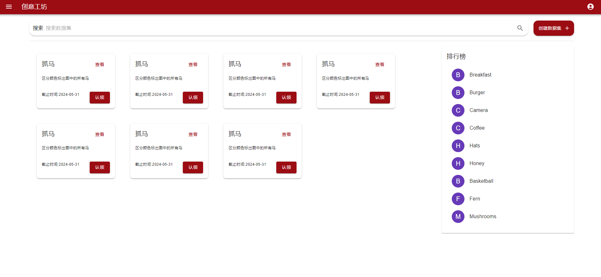
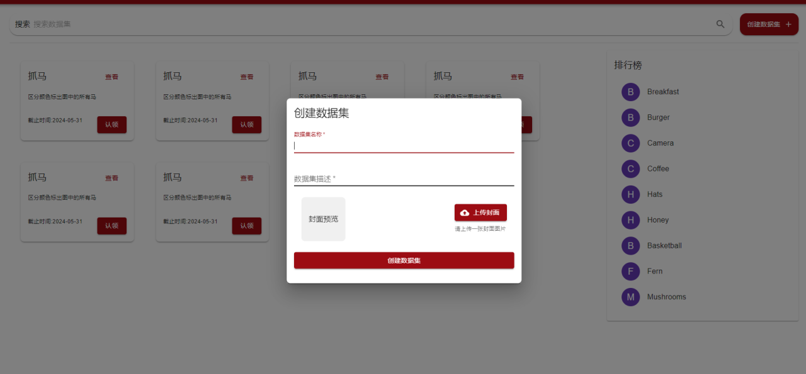
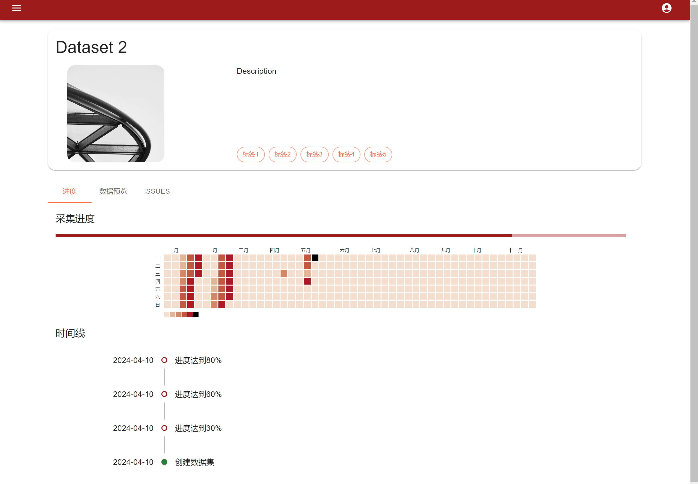
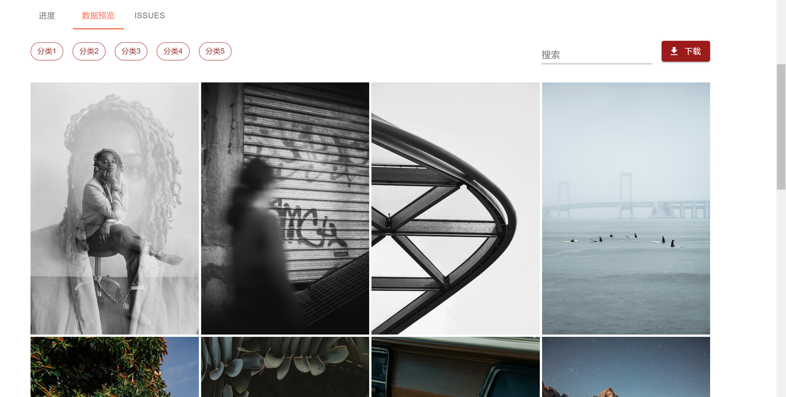
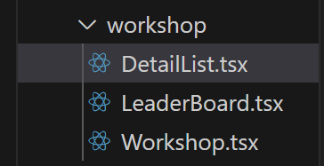
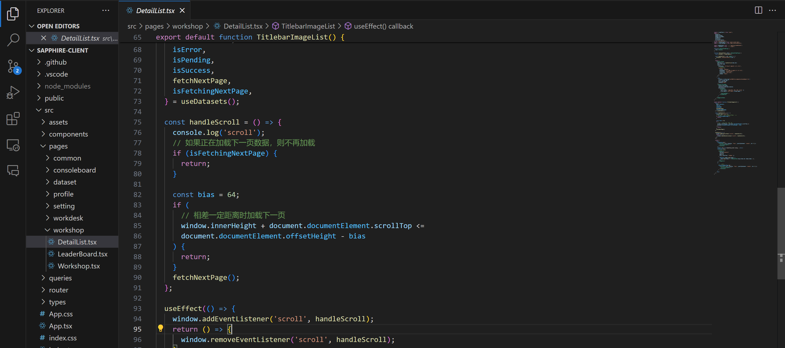
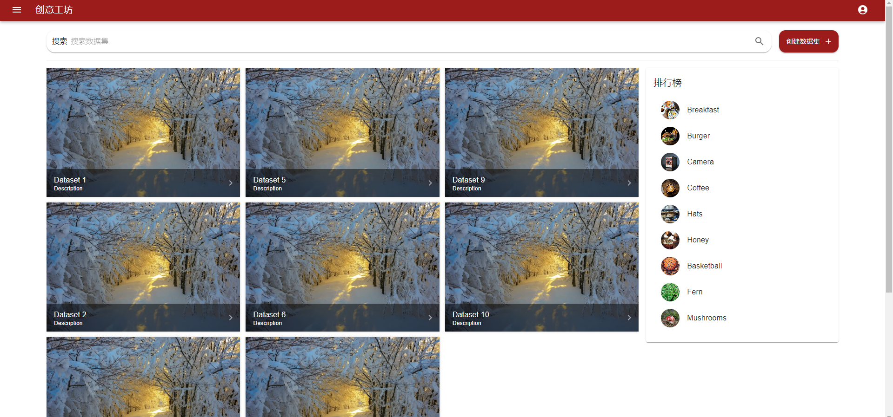

# 前端7 - 创意工坊

我本周的工作是完成了系统平台的创意工坊部分。

**创意工坊：**

是一个专门的区域，让用户分享关于数据标注任务的创意、经验和解决方案。

- 个性化账号：用户可以通过积分兑换系统，定制个性化账号信息、个人背景和边框装饰等，从而增强其在平台上的个性化展示和参与动力。

- 界面设计：设计直观友好的界面，让用户可以轻松浏览、搜索和参与创意工坊中的内容和讨论。

## 1 主界面

- 占据主要画面的是若干数据集，小组件上显示了数据集的若干关键信息，如数据集名字、数据集描述、截止收集数据时间、查看详情按钮、认领按钮等等。当然，未来可能还会有很多更新。
- 右侧是实时更新的用户排行榜，展示了综合评分最高的用户们。
- 支持搜索数据集

## 2 创建数据集

同样是在主界面，点击右上角的“创建数据集”，可以允许用户自主上传数据集进行标注。

## 3 数据集详情界面

点击上述的任一个数据集，可以进入该数据集的详情界面：

这个界面详尽地展示了数据集的信息，包括数据集的名称、数据集描述、数据集的tag、采集进度及时间线。

- **热力图**：界面中的热力图显示了不同天数（从N1到N7）的活动或完成度的不同级别，通过红色的不同阴影表示，帮助用户快速识别哪些日期有更高的活动量或进度。
- **进度条**：采集进度通过一个水平的进度条展示，红色填充部分大约占30%，直观美丽地显示了当前的完成状态。
- **时间线**：时间线下方列出了具体的日期和时间戳，旁边是关于数据集标注进度的描述，如“进度变动：30%”，提供了一个时间顺序上的进度记录。

点击数据概览，可以跳转到数据示例图片。界面的顶部包含了多个标签，如“全部”、“风景”、“人物”、“静物”和“动物”，用户可以通过这些分类浏览不同类别的照片。此外，右侧的搜索栏可以搜索特定的图片或下载数据。这个部分尚待修改完善。

最后，提供一个Issue页面，方便用户对该数据集提出勘误。

## 4 代码实现思路

文件夹结构：

其中一个组件的基本实现思路：

1. **导入必要的React和Material-UI组件**：使用`useEffect`来处理副作用，`ImageList`和`ImageListItem`等组件来构建图片列表，以及`CircularProgress`来显示加载指示器。
2. **使用自定义钩子`useDatasets`**：这个钩子是用来获取数据集信息的。它提供了数据集(`datasets`)、错误状态(`isError`)、加载状态(`isPending`)、成功状态(`isSuccess`)、获取下一页函数(`fetchNextPage`)和是否正在获取下一页(`isFetchingNextPage`)等信息。
3. **创建`DatasetItem`组件**：这个组件接收一个数据集对象作为属性，并在点击时导航到该数据集的详细页面。它使用`ImageListItem`来展示每个数据集的图片和信息，并在鼠标悬停时提供视觉反馈。
4. **无限滚动加载**：通过监听滚动事件来实现。当用户滚动到页面底部附近时，会调用`fetchNextPage`函数来加载更多数据集。
5. **效果处理**：使用`useEffect`钩子来添加和清除滚动事件监听器。
6. **条件渲染**：根据不同的状态（加载中、错误、成功），渲染不同的UI元素。例如，在加载中时显示`CircularProgress`，在加载成功时显示图片列表。
7. **图片列表布局**：使用`ImageList`组件的瀑布流变体(`masonry`)来展示图片，这种布局可以优化不同高度图片的显示效果。

在实现这块的时候，遇到了很多乱七八糟的问题，比如：

- **性能问题：**一开始展示数据集小组件时，用了数据集的典型图片作为封面。这就导致了，一次性加载过多图片可能会导致页面加载速度变慢。解决这个问题的方法之一是实现懒加载，只有当用户滚动到页面的特定部分时才加载图片。

  

- **响应式设计**：设计页面时，需要保证图片在不同大小的屏幕上都能正确显示，涉及到使用媒体查询和flex布局等技术。

- **错误处理**：在图片加载失败时，需要有备选方案，比如显示一个占位符或者错误信息。一开始没有考虑到这一点，导致图片加载之后布局完全混乱了。
- **加载提示：**图片加载过程可能比较慢。我们想到的优化方法是，提供一些视觉反馈，例如加载指示器，可以改善用户的体验。
