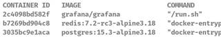
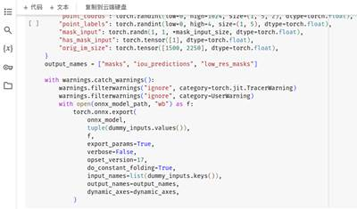

# 后端1 - 确定后端技术框架

## 1 核心需要概述

本系统中，后端的核心需求主要包括：

-  提供用户注册、登录、登出等用户管理功能

-  提供模型嵌入、模型管理的功能

-  任务发布、任务分发功能

-  统计数据收集、分析

## 2 关键层

后端使用***Spring Cloud Alibaba***框架开发，预期使用的组件包括但不限于：

-  Spring Boot Actuator

-  Spring Boot Validation

-  Nacos Discovery

-  Nacos Config

-  Spring Cloud Loadbalancer

-  Sentinel

-  OpenFeign

### 2.1 网关层

业务网关层使用***Spring Cloud Gateway***，提供统一的API入口，对请求进行路由、限流、鉴权等操作。

Nginx 网关负责服务器端的转发与负载均衡。

### 2.2 业务层

业务应用使用***Docker***进行容器化管理，搭建CI/CD执行自动编译，Shell 脚本打包***Docker Image***和更新。根据业务规模酌情考虑多台机器上的业务分布。

### 2.3 持久化层

数据库使用***PostgreSQL***，提供数据存储服务。多节点部署，保证数据的高可用性，同时集群化部署，热备份，并且实现读写分离，保证数据一致性。

采用***Redis***作为缓存数据库，提供缓存服务，减轻数据库的压力。同时，在分布式系统中，使用***Redis***作为分布式锁，保证数据的一致性。

所有持久化数据至少都保证主从备份。

## 3 技术验证

### 3.1 网络验证

从两三个节点开始，架设至少主从的网络拓扑结构。对于每个节点，都使用ufw进行防火墙配置，只开放必要的端口。

```shell
sudo ufw default deny incoming
sudo ufw default allow outgoing
```

这样以后，自主放行一些incoming流量。

最后***sudo ufw enable***，开启防火墙。

### 3.2 中间件部署验证

在不同服务器上使用 Docker 部署各个中间件，测试各个中间件的可用性。



主从配置例子如下：

```shell
docker run -d \
-p 5773:5432 \
-e POSTGRES_PASSWORD=EM45rjPbymGHLenq \
-v /data/postgres/master/:/var/lib/postgresql/data \
--name postgres-master \
--restart unless-stopped \
-h postgres-master \
-e LANG="C.UTF-8" \
-e 'TZ=Asia/Shanghai'  \
-m 512m  \
--memory-swap -1 \
postgres:13-alpine3.18
```

WAL（Write-Ahead Log）是 PostgreSQL 中的一种事务日志，用于记录对数据库的更改操作。它是一种持久化的日志，记录了对数据库进行的每个事务的详细更改。WAL 允许数据库在发生故障时进行恢复，并支持主从复制和逻辑复制等高级功能。通过持久化的 WAL 日志，PostgreSQL 可以保证数据的一致性和持久性。

***wal_level***可以是***minimal***，***replica***，***logical***，区别在于：

-  ***minimal***只提供必要的信息以支持数据库的恢复，不支持任何形式的复制；

-  ***replica***：记录足够的信息以支持从服务器的物理复制。它包含主服务器上的所有更改，从服务器可以使用这些信息进行复制和恢复；

-  ***logical***级别的复制中，WAL 用于逻辑复制。逻辑复制允许选择性地复制特定的表和数据更改，而不是简单地复制整个数据库。

开启***archive_mode***，PostgreSQL 将尝试执行归档命令来将 WAL 日志文件复制到归档目录。

验证主从连接，在 master 节点上，进入 PostgreSQL，执行 ***select client_addr,sync_state from pg_stat_replication;***，能够观察到形如下文的结果，即配置成功。

```shell
postgres=# select client_addr,sync_state from pg_stat_replication;
  client_addr  | sync_state 
---------------+------------
 172.16.193.30 | sync
(1 row)
```

### 3.3 CI/CD 部署验证

项目使用 Jenkins 进行 CI/CD 部署验证，编写 Pipeline 脚本，实现自动化部署。

此外，同时利用 GitHub Actions 进行 CI/CD 部署验证。

### 3.4验证深度学习模型嵌入调用验证

在 Jupyter Notebook 中测试了小规模的深度学习模型，验证模型的准确性。

