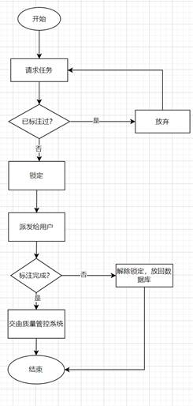

# 周报01 - 项目概述

### 1 项目背景

###### 1.1 研究背景

在人工智能和机器学习领域，数据标注的重要性不言而喻。这是训练准确模型的基础，直接影响到模型的性能和应用效果。然而，传统的手动数据标注方法效率低下，成本高昂，且难以保证一致性和准确性。随着数据量的爆炸性增长，这些问题愈发突出。

**技术角度：**

随着深度学习和其他人工智能技术的发展，数据标注不再局限于人工操作。现代技术使得数据标注过程可以通过算法自动完成，大幅提高了效率和准确性。例如，AI预标注技术可以在语音转写项目中自动完成语音识别和文字转写的预处理操作，之后只需人工进行少量校对。此外，质量控制也逐渐由人工审核转向AI质检，通过算法评估标注结果的准确性。

例如，**SAM（Segment Anything Model）模型**作为Meta AI推出的一种创新的图像分割模型，能够在无需训练的情况下对任何目标进行分割，为自动化数据标注提供了新的可能性。这也就大大降低了图像领域的标注门槛。

**市场角度：**

数据标注市场规模正迅速扩大，并呈增长趋势。据澎湃新闻的报告，中国的AIGC数据标注市场规模已达到百亿量级，且预计未来几年将持续增长，到2025年市场规模将突破100亿元。

同时，数据标注行业的竞争格局也正在发生变化，大模型公司和AI企业正在涌入这一领域。自建数据处理管线，提供一站式、定制化的数据解决方案，是数据行业的大势所趋，具有巨大的市场需求和商业机会。

综上，随着技术的进步和市场的扩大，数据标注正逐渐从一个辅助性角色，转变为推动人工智能发展的关键力量。

### 1.2 现存产品

目前，市场上的数据标注产品主要分为两类：**传统的人工标注服务和基于AI技术的自动化标注服务**。

传统的人工标注服务通常依赖于大量的标注人员手动处理数据。优点在于能够处理高度定制化的标注任务，然而，它们的缺点也很明显，包括成本高、效率低、扩展性差等。

基于AI的自动化标注服务则利用机器学习模型来自动识别和标注数据，优势在于能快速处理大量数据，但在处理复杂任务时的准确性可能有所欠缺。

我们的项目——**Sapphire：基于SAM的智能辅助数据标注平台，基于Segment Anything Model(SAM)的先进图像分割技术，结合众包概念和冗余任务分发模式**，为用户提供了高效、准确、低成本、易扩展的数据标注解决方案，还提供用户友好的界面和管理系统，填补了该细分领域的市场空白。

### 1.3 解决方案

近年来，自动化数据标注技术和众包平台的发展为数据标注领域带来了革命性的变化。

**自动化标注技术**通过算法和模型的应用，能够自动提取和标注数据，显著提高了标注的速度和效率，同时也降低了人工成本。其中，以SAM通用视觉大模型最为出色。

[**附件2：Segment Anything(SAM)模型调研报告**](#附件2)**中详细描述了这部分。**

**众包平台**则利用互联网的力量，集合了全球范围内的人力资源，不仅提升了数据标注的质量，还能够快速适应多变的项目需求。

在传统数据标注的基础上，本平台的设计理念是将人工智能与人类智慧相结合，以达到数据标注的最优效果。本项目有以下特点：

- 设定管理员与个人用户双角色。管理员负责任务发布和管理，标注者参与数据标注，个人用户可以是数据提供者或标注结果的使用者。

- 引入众包概念，允许广泛的用户参与标注过程，提升数据多样性和标注质量。

- 实现了数据标注任务的发布、分发、收集、分析、统计、管理等功能。

- 通过AIGC辅助标注，提高标注效率及正确率。

- 通过不同用户标注同一图片、对比结果的方式，确保标注结果的准确性和一致性。

- 兼有激励机制，增加用户黏性。

# 2 目标用户

本项目的目标用户群体非常广泛，涵盖了需要高质量数据标注服务的各个领域。包括但不限于以下几类：

1. **研究机构和学术团队：**需要大量标注数据来进行机器学习和数据分析研究的团队。

2. **AI公司和初创企业：**寻求提高数据处理效率，降低成本，并快速迭代其AI模型的企业。

3. **医疗健康行业：**需要精确标注医学图像数据以辅助诊断和治疗的医疗机构。

4. **自动驾驶汽车公司：**依赖于大量精确标注的传感器数据来训练其自动驾驶算法的公司。

5. **公共安全和监控：**需要自动化分析和标注监控视频数据的政府或安全机构。

6. **电子商务平台：**需要标注商品图片以提升搜索和推荐系统准确性的在线零售商。

通过为这些用户群体提供一个强大且易于使用的自动数据标注平台，可以极大地推动相关领域的研究和应用发展，同时也为平台的持续改进和创新提供动力。

# 3 项目内容

**Sapphire：基于SAM的智能辅助数据标注平台系统**包括以下五大模块：

### 3.1 用户系统

用户系统是本数据标注平台的基石，负责处理用户的注册、登录、角色分配、权限管理及个人信息维护等功能。用户系统应兼具可用性和安全性。

###### 3.1.1系统角色定义

-  **系统管理员：**有用户管理权限、可以发布官方任务、查看全局统计信息

-  **众包发布者：**可以发布任务、发布时需指定对于任务投入的积分

-  **工人：**认领任务者，上线后可以即时认领任务开始标注，每张图片有其价格（与发布者投入的积分有关）

用户角色既可以认领任务也可以发布，也就是既可以做发布者也可以做工人。

###### 3.1.2 用户端功能

- **注册与登录：**新用户可以通过邮箱等注册，获取个人用户身份。注册后，用户可以登录平台，开始参与数据标注或管理标注任务。

- **个人资料管理：**用户可以编辑个人信息，如联系方式、密码等。

- **标注任务接收和提交：**接收、参与和提交标注任务。用户可以根据自己的兴趣和技能匹配任务。

- **标注工具与界面：**使用平台提供的多种标注工具和友好的界面进行数据标注。工具可以根据不同任务类型，如目标检测、分割等，进行相应的定制。

- **数据集浏览与下载：**用户可以花费积分等，获取平台提供的数据集。

- **激励机制：**积分与排名

a)  完成任务可获得积分，获取数据集需消耗积分

b)  用户可以查看自己的积分，参与平台排名竞争。

c)  标注质量保证：用户需要按照规定的标注准则进行标注，并确保标注结果的准确性和一致性。标注质量呈现在积分中。

###### 3.1.3 管理员端功能

-  **用户管理：**管理用户账户，包括注册审核、权限分配、用户数据统计等。

-  **任务发布与管理：**管理任务的生命周期，包括任务创建、任务分发、任务进度监控等。

-  **数据集管理：**创建、维护、删除数据集等。

-  **数据质量保证：**制定标注准则和质量评估方法，确保标注结果的准确性和一致性。

-  **分析统计：**查看和生成各类分析统计报告，包括用户维度、数据集维度和全局维度的统计数据，进行数据分析和决策。

-  **系统监控：**监控系统状态，确保平台稳定运行。

-  **激励机制管理：**管理员可以设置和调整激励机制，如积分规则和排名奖励。

### 3.2 分发系统

**系统定义：**

分发系统面向所有工人。由系统提供算法对所有待分配的任务进行分配。分发系统是众包系统的核心之一，需要设计算法准确、迅速的发布众包到具体工人，并及时更新任务标注状态。

**系统目标：**

-  高效

分发系统必须是高效的，当用户上线选择众包并开始标注后，系统必须能够迅速的做出响应，派发给用户需要标注并且未被当前用户标注过的数据。

-  正确率保证

分发系统还需保证标注的一致性。为保证标注的正确性，每张图片需要至少2名工人标注。系统需要设置恰当的算法比对两人标注结果的一致性，当标注差距超过预定阈值时，需要继续将此图片派发给第三个工人，若第三人与前两者标注不一致，则需继续派发、采取投票策略，超过5人仍无法确定时，图片标记为异常图片。

-  一致性

系统必须保证在多用户同时标注同一数据集的情况下仍能做出正确派发策略，确保每张图片被预定的人次标注。例如图片A需要两人标注，那么当10人同时上线时，不能将A同时派发给此10人。

-  预分发

为保证分发的效率与一致性，当用户认领时，会立刻在后台预锁定一批图片，锁定状态当作已标注处理。在用户标注时候，需要设置缓冲区，提前将将要标注的图片返回给工人，提升工人标注体验。

-  后处理

任务完成后，系统会触发后处理工作。对工人派发积分奖励，计算工人标注准确率并交给激励系统处理。最终将处理好的数据集放入后台，由任务发布者下载使用。

 

**分发策略：**

分发系统的数据流图如上。用户通过请求系统向数据库请求任务，请求系统会根据用户选择的数据集、用户已标注过的数据从数据库中选择数据进行分发，选择时会采取先锁定再分发的策略，由请求系统预锁定一批任务，然后交由用户标注，用户标注完成后在DB中解除锁定并改为已标注状态。流程图如下：

**质量管控：**

质量管控系统负责标注结果的正确性监测与保证。如果某任务非第一次标注，则与之前标注的结果进行比对，当差异超过阈值时，则需要下次派发，否则标注结束，进行后续工作，后续包括对标注工人评价，存入数据库，计算最终可训练数据等。

**性能优化：**

为了提供更优的性能，采取后台加载的策略，当用户进行数据标注的同时，从后台拉取预锁定图片，可以减少用户的等待时间。同时再前端设置缓冲区，缓冲区未慢时，从后端拉取任务，如果已满则暂停拉取。

### 3.3  辅助系统

-  **领航者模式（Copilot Mode）**

用户提供初步的点或框图标注，SAM模型基于这些信息进行识别和标注。这种模式适用于需要精确位置信息的标注任务，如物体检测或图像分割。

-  **半自动模式（Semi-Automatic Mode）**

半自动模式中，SAM模型根据给定的文本进行初步标注，然后由人工进行核查和修正。这种模式结合了AI的高效率和人类的判断力，适用于需要文本理解和验证的标注任务。

-  **全自动模式（Fully Automatic Mode）**

全自动模式利用GPT vision作为中介，以解决SAM（Segment Anything Model）在文本识别方面的不足。在这种模式下，AI系统处理复杂的语义信息，并由GPT完成性能评估。这种模式适用于需要处理复杂语义和大量数据的场景，可以实现高度自动化的数据标注。

### 3.4 分析统计

**用户维度：**

-  用户角色与权限：分析不同用户在平台上的角色和权限，例如标注员、管理员等，以及他们在平台上的操作行为和需求。

-  用户活跃度：分析用户在平台上的活跃度，包括登录频率、标注次数等，了解用户参与度和贡献度。

-  用户反馈：收集用户反馈数据，了解用户对平台功能、界面和服务的满意度，以及可能的改进建议。

**数据集维度：**

-  数据标注质量：分析数据标注的质量指标，如准确性、一致性和完整性，评估标注结果的可靠性。

-  数据集分布与特征：分析数据集中不同类别或类型数据的分布情况和特征，为标注任务的设计和优化提供依据。

**全局维度：**

-  平台整体效率：分析整体平台的运行效率，包括标注任务的完成速度、审核流程的效率等，以提高整体工作效率

-  数据利用与应用：探讨标注数据的应用领域和潜在价值，分析标注数据对业务决策和模型训练的影响。

-  模型评估和优化：评估建立的模型在全局数据上的效果，并根据评估结果对模型进行优化和调整。

### 3.5 激励机制

**排名系统：**

-  标注员排名：根据标注员的标注质量、效率和参与度等指标，设立排名系统，对表现优秀的标注员进行排名展示。

-  数据集质量排名：根据数据集的质量评估指标，对数据集的质量进行排名，激励用户创建高质量的数据集。

**积分系统：**

-  任务积分奖励：为达到标注任务标准线的标注元提供积分奖励，标准线设置为每位标注员的平均标注积分，未达标的标注员会扣除相对应的积分。积分可以用于兑换奖励或提升在平台上的身份和权限。

-  质量奖励积分：根据标注质量评估结果，奖励标注质量高的标注员额外积分，鼓励提高标注质量。

### 3.6 数据集系统

**创建数据集：**

-  数据集需求分析：管理员提供数据需求和标注任务类型，根据商户需求发布不同类型的数据集。

**发布数据：**

-  数据集发布：

-  用户（小量数据集）消耗积分在平台内上传数据集，标注员直接接单，完成标注。

-  商户（大量数据集）向平台提供数据集，管理员接收后设置积分，发布成官方任务，标注员可以接单完成标注。

-  数据集权限管理：设定数据集的访问权限，包括公开数据集、私有数据集和共享数据集，以保护数据安全和隐私。

**创意工坊：**

是一个专门的区域，让用户分享关于数据标注任务的创意、经验和解决方案。

-  个性化账号：用户可以通过积分兑换系统，定制个性化账号信息、个人背景和边框装饰等，从而增强其在平台上的个性化展示和参与动力。

-  界面设计：设计直观友好的界面，让用户可以轻松浏览、搜索和参与创意工坊中的内容和讨论。

