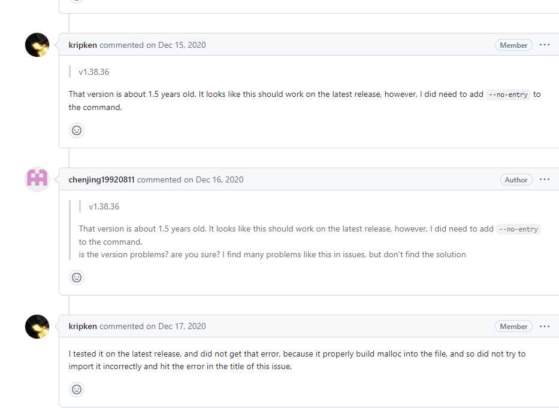
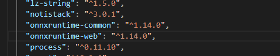

## 任务描述

本周实现并封装了模型的运行，需要在前端安装依赖的库，编写对应的处理函数。同时需要能够展示出抠图效果。

## 依赖与环境配置

尝试在前端接入并运行onnx。

在前端运行onnx依赖于onnxruntime-web这个包，这个包可以在浏览器进行模型推理。

首先`npm install onnxruntim-web`

运行模型依赖于wasm文件中的函数，所以需要设置一下ort的全局环境。


这里配置的wasmPath是所依赖的wasm的路径。

## 初始化模型并运行

然后尝试初始化模型


```react
        const MODEL_DIR =
          "./interactive_module_quantized_592547_2023_03_19_sam6_long_uncertain.onnx";
        const URL: string = MODEL_DIR;
        // const URL: string = process.env.MODEL_DIR;
        const model = await InferenceSession.create(URL);
```

这里URL是模型的位置，使用onnxruntime提供的InferenceSssion.create方法来创建一个model用于此后的推理。

## 问题与解决

但是这里遇到了一个报错。


看起来是使用wasm编译onnx时报错，从网上查找类似问题的解决方案。



这里有人有类似问题，通过升级版本解决了这一问题，但是目前项目中安装的已经是onnxruntime-web的最新版1.18，仍然不能使用。

不过此人的解决思路给了我启发， 发现sam-demo中使用的是onnxruntime-web1.14，而本地使用的是1.18，可能是版本不兼容导致的。

这里将package.json中的版本也降为1.14试一下。

发现还是同样的报错。这里又尝试了很多其他方法还是不行。

最后还是怀疑是版本问题，然后npm list看了一下包版本


？？？？竟然还是1.18版本，但此时package.json中的版本已经改成了1.14。



最后查阅资料得知，使用^1.14.0的写法，npm会自动安装大版本下的最新小版本，所以就会默认装上1.18.应该使用1.14.0的写法。

改写版本号后重启，问题解决。

## 总结

npm竟然会自动跟进相同主版本号的最新次版本号，而不是修订号，感觉不是很人性化，增加了debug难度。

onnxruntime-web竟然在次版本号更新没有做同主版本号的前向兼容，逆天。。。。

给自己也提了个醒，以后更新版本之后先npm list看一眼真实版本号。