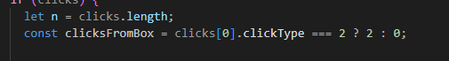
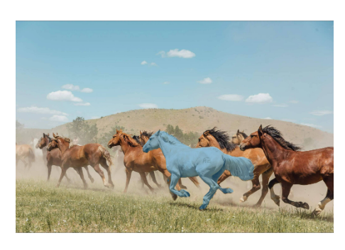

## 任务描述

本周任务，将模型进行封装，实现模型推理的基本API，从而可以根据输入数据输出蒙版数据。

## 模型输入数据处理

首先进行模型输入数据的预处理。首先支持点击和框选两种模式，所以这里需要对这两种模式进行适配。

modelData函数接收一个关于用户点击或者框选操作的输入，以及一个此前的推理结果（sam模型要求提供一个上次的推理结果）。

然后我们首先判断框选类型。



这里如果clickType为2那么说明是框选，否则是点击。

如果是框选的话，我们需要计算出模型的左上角和右下角坐标。

```react
    if (clicksFromBox) {
      // For box model need to include the box clicks in the point

      pointCoords = new Float32Array(2 * (n + clicksFromBox));
      pointLabels = new Float32Array(n + clicksFromBox);
      const {
        upperLeft,
        bottomRight,
      }: {
        upperLeft: { x: number; y: number };
        bottomRight: { x: number; y: number };
      } = getPointsFromBox(clicks[0])!;
      pointCoords = new Float32Array(2 * (n + clicksFromBox));
      pointLabels = new Float32Array(n + clicksFromBox);
      pointCoords[0] = upperLeft.x / modelScale.onnxScale;
      pointCoords[1] = upperLeft.y / modelScale.onnxScale;
      pointLabels[0] = 2.0; // UPPER_LEFT
      pointCoords[2] = bottomRight.x / modelScale.onnxScale;
      pointCoords[3] = bottomRight.y / modelScale.onnxScale;
      pointLabels[1] = 3.0; // BOTTOM_RIGHT

      last_pred_mask = null;
    }
```

如果是点击的话，我们需要知道所有的点击点，这里我们用一个clicks数组来保存每个点击操作的坐标。然后将所有的点击添加到最终输入给模型的pointCoords数组。

```react
    for (let i = 0; i < n; i++) {
      pointCoords[2 * (i + clicksFromBox)] = clicks[i].x / modelScale.onnxScale;
      pointCoords[2 * (i + clicksFromBox) + 1] =
        clicks[i].y / modelScale.onnxScale;
      pointLabels[i + clicksFromBox] = clicks[i].clickType;
    }

    if (!clicksFromBox) {
      pointCoords[2 * n] = 0.0;
      pointCoords[2 * n + 1] = 0.0;
      pointLabels[n] = -1.0;
      // update n for creating the tensor
      n = n + 1;
    }
```

这里pointlabels直接根据click的type来判断就行，-1就是反点（不选的点），1就是被选择的点。

然后根据需要将数据转换成Tensor，最后得到了模型需要的输入。

```react
    pointCoordsTensor = new Tensor("float32", pointCoords, [
      1,
      n + clicksFromBox,
      2,
    ]);
    pointLabelsTensor = new Tensor("float32", pointLabels, [
      1,
      n + clicksFromBox,
    ]);
  }
  const imageSizeTensor = new Tensor("float32", [
    modelScale.maskHeight,
    modelScale.maskWidth,
  ]);
  if (pointCoordsTensor === undefined || pointLabelsTensor === undefined)
    return;

  const lastPredMaskTensor =
    last_pred_mask && clicks && !isFirstClick(clicks)
      ? last_pred_mask
      : new Tensor("float32", new Float32Array(256 * 256), [1, 1, 256, 256]);

  const hasLastPredTensor = new Tensor("float32", [
    +!!(last_pred_mask && clicks && !isFirstClick(clicks)),
  ]);

```

## 模型运行与蒙版生成

```react
      const feeds = modelData({
        clicks,
        tensor,
        modelScale,
        last_pred_mask: predMask,
      });
      if (feeds === undefined) return;
      const results = await model.run(feeds);
      const output = results[model.outputNames[0]];
      if (hasClicked) {
        const pred_mask = results[model.outputNames[1]];
        setPredMask(pred_mask);
        if (!predMasksHistory) {
          setPredMasks([...(predMasks || []), pred_mask]);
        }
        const svgStr = traceOnnxMaskToSVG(
          output.data,
          output.dims[1],
          output.dims[0]
        );
        setSVG(svgStr);
        setMask(output.data);
      }
```

使用刚才编写modelData来生成一个模型输入需要的数据feeds之后，使用model.run方法来执行推理，最终的推理结果将转换成svg蒙在原图之上，形成一种被选中的“错觉”。



