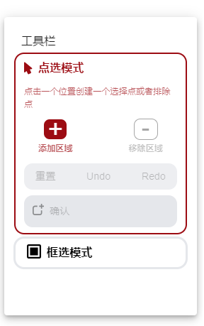
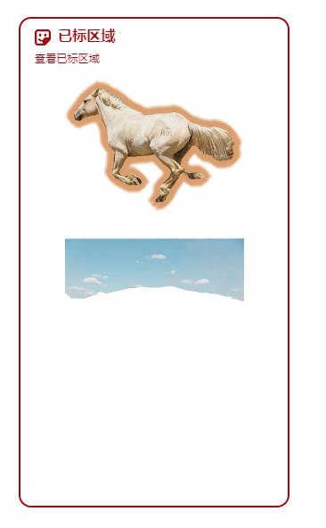
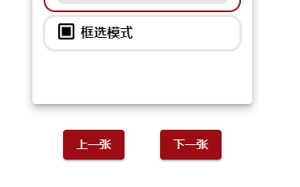
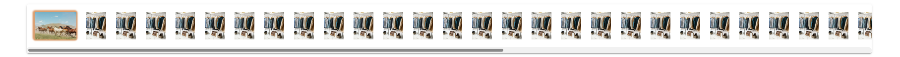
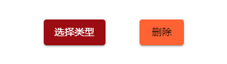
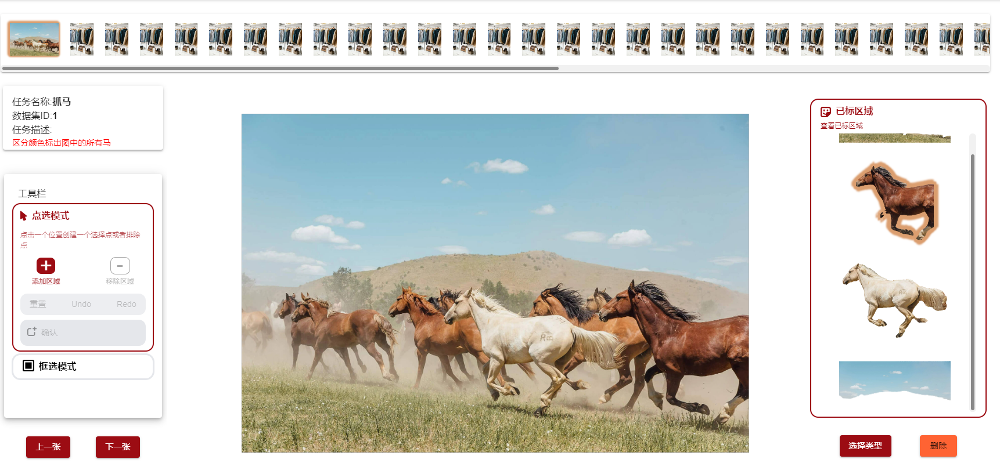

## 本周任务

为模型编写工具框，适配数据标注环境。接入图片和embeeding数据的传入和标注数据的构造。

## 状态解释

设计一些全局状态便于在各层次组件获取当前工作台状态。

```react
    click: [click, setClick], //当前的点击位置（追踪鼠标位置）
    clicks: [clicks, setClicks], //全部的点击位置数组
    image: [image, setImage], //需要被推理的数组
    prevImage: [prevImage, setPrevImage], //此前的图片，用于重置操作
    svg: [, setSVG], //蒙版svg
    svgs: [svgs, setSVGs], //全部的蒙版svg
    allsvg: [, setAllsvg],
    isErased: [, setIsErased], //是否被擦除
    isModelLoaded: [, setIsModelLoaded], //模型是否加载
    isLoading: [, setIsLoading], //是否正在加载图片和embedding
    segmentTypes: [, setSegmentTypes], //当前的分割类型
    maskImg: [, setMaskImg], //蒙版图片
    isErasing: [isErasing, setIsErasing], //是否正在擦除
    stickerTabBool: [stickerTabBool, setStickerTabBool],
    isMultiMaskMode: [isMultiMaskMode, setIsMultiMaskMode], //
    isHovering: [isHovering, setIsHovering],
    showLoadingModal: [showLoadingModal, setShowLoadingModal],
    eraserText: [eraserText, setEraserText],
    predMask: [predMask, setPredMask], //之前的蒙版
    predMasks: [predMasks, setPredMasks],
    predMasksHistory: [predMasksHistory, setPredMasksHistory],
    isToolBarUpload: [isToolBarUpload, setIsToolBarUpload],
    stickers: [stickers, setStickers], //所有扣完的元素
```

## 添加工具栏



工具栏包含点选模式和框选模式。

点选模式通过修改clicks来添加一个正点（负点）。框选模式框住一个区域，框选区域的左上和右下坐标会被装入clicks中，用于后续推理。

Undo会撤销最后一次点击操作，Redo会加回撤销的操作，重置会清空蒙版，然后重置所有状态。

点击确认会将推理结果加入stickers中，形成抠图数据。

## 添加结果栏

添加结果栏，用于展示当前已经抠出的区域。



这里只要遍历stickers，然后将stickers中的canvas内容展示出来即可。 当用户点击确认时，需要计算出一个图片加入到stickers中去，这里需要编写一个计算方式。

```react
 const cropImageFromCanvasTS = (ref: any) => {
      let newCanvas = null;
      let stickerData = null;
      try {
        const canvas = ref!.toCanvas().getContext("2d");

        let w = ref.width();
        let h = ref.height();
        const pix: { x: number[]; y: number[] } = { x: [], y: [] };
        const imageData = canvas.getImageData(0, 0, w, h);
        let x;
        let y;
        let index;

        for (y = 0; y < h; y++) {
          for (x = 0; x < w; x++) {
            index = (y * w + x) * 4;
            if (imageData.data[index + 3] > 0) {
              pix.x.push(x);
              pix.y.push(y);
            }
          }
        }
        pix.x.sort(function (a: number, b: number) {
          return a - b;
        });
        pix.y.sort(function (a: number, b: number) {
          return a - b;
        });
        const n = pix.x.length - 1;

        stickerData = {
          center_x: (pix.x[n] + pix.x[0]) / 2 / w,
          center_y: (pix.y[n] + pix.y[0]) / 2 / h,
          w: (1 + pix.x[n] - pix.x[0]) / w,
          h: (1 + pix.y[n] - pix.y[0]) / h,
        };
        // console.log({
        //   center_x: ((pix.x[n] + pix.x[0]) / 2)/w,
        //   center_y: ((pix.y[n] + pix.y[0]) / 2)/h,
        //   w:(1 + pix.x[n] - pix.x[0])/w,
        //   h:(1 + pix.y[n] - pix.y[0])/h
        // })

        w = 1 + pix.x[n] - pix.x[0];
        h = 1 + pix.y[n] - pix.y[0];
        const cut = canvas.getImageData(pix.x[0], pix.y[0], w, h);

        canvas.width = w;
        canvas.height = h;
        canvas.putImageData(cut, 0, 0);
        newCanvas = document.createElement("canvas");
        newCanvas.width = w;
        newCanvas.height = h;
        newCanvas.getContext("2d")!.putImageData(cut, 0, 0);
```

这个函数根据蒙版信息计算抠图区域，蒙版中为0的区域是没有被框选的，如果不是0，说明是被抠出的部分，那就加入到新的canvas中去。最终分别找到x轴和y轴的最大和最小值，这样得到一个矩形区域，从蒙版中抠出这个区域即可。

同时我们还需要计算出一个可以交由后端保存，此后用于数据训练的数据。以yolo为例，训练的数据集需要提供抠图区域的中心相对坐标、相对宽度、相对高度。所有的相对值都是相对于总高度和总宽度而言的，所以都是0~1之间的值，我们把这个数据保存到stikerData中，一同返回。

## 添加图片切换

然后我们还需要添加图片切换功能。

首先在工具栏下添加上一张和下一张按钮。用于单张切换图片。



切换图片时，只要切换image和embedding即可，通过useEffect来监听这两者的变化，当他们发生变化时，我们会清空所有数据，然后将新图片交由模型进行推理。

```react
  useEffect(() => {
    if (imgUrl && embeddingUrl)
      handleSelectedImage(new URL(imgUrl), embeddingUrl, {
        shouldDownload: false,
        shouldNotFetchAllModel: true,
      });
    setStickers([]);
  }, [imgUrl, embeddingUrl]);	
```

使用同样的方法，我们添加一个全部任务的展示栏，用于展示全局的任务。



切换图片时，修改方式与之前上下张切换类似，我们使用一个pos状态记录当前的任务位置，然后点击某张图片的时候我们修改pos的值即可。

根据用户习惯，在这里滚动滚轮，理论上应该会横向滚动才对，所以我们添加一个监听器，监听这个位置的滚轮状态，组织默认行为，使用js修改当前容器的y轴。

```react
  useEffect(() => {
    const tabsContainer = imgListContainer.current;

    const handleWheel = (event: any) => {
      event.preventDefault();
      tabsContainer!.scrollLeft += event.deltaY;
    };

    if (tabsContainer) {
      tabsContainer.addEventListener("wheel", handleWheel);
    }

    return () => {
      if (tabsContainer) {
        tabsContainer.removeEventListener("wheel", handleWheel);
      }
    };
  }, []);

```

## 抠图结果控制

对于抠图结果也需要控制，用户需要删除已抠的图，或者为抠出来的图选择id（类型）。

所以这里我们添加两个按钮

用于删除当前选中的sticker或者为当前的sticker选择类型。

删除的时候，我们只要重新设置stickers状态即可。

```react
 const handleDelete = () => {
    if (stickers === null || stickers.length === 0) {
      enqueueSnackbar("请先创建一个贴纸", { variant: "error" });
      return;
    }
    if (
      activeSticker === null ||
      activeSticker < 0 ||
      activeSticker >= stickers!.length
    ) {
      enqueueSnackbar("请选择一个贴纸", { variant: "error" });
      return;
    }
    setStickers(stickers.filter((_, index) => index !== activeSticker));
    setActiveSticker(0);
  };
```

这里通过filter来删除选中的贴纸。

选择类型留坑待填。。。。

## 效果

目前抠图效果如下，此处功能基本完成。


