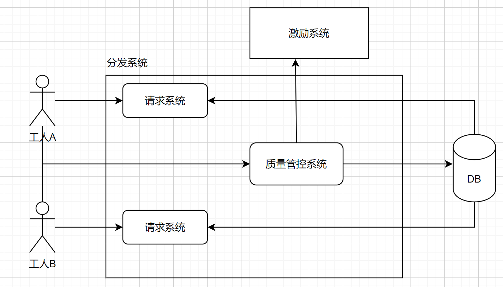
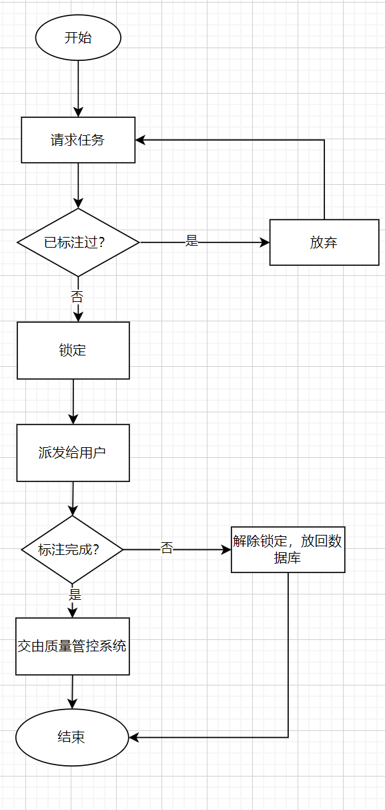
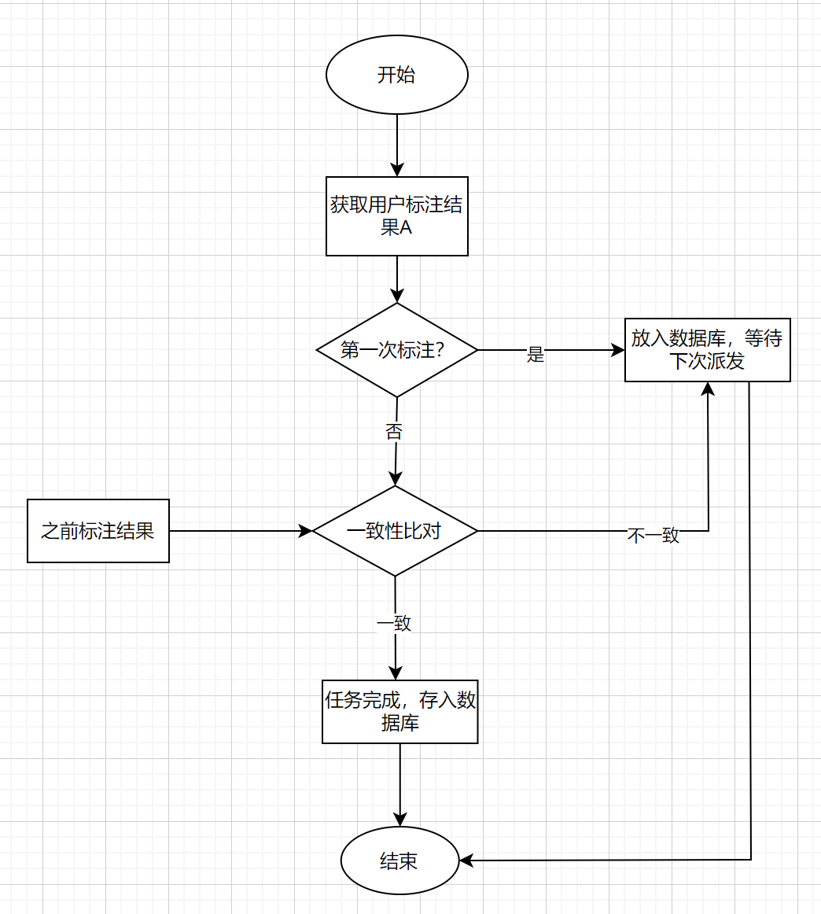

### 系统角色定义

系统管理员：有用户管理权限、可以发布官方任务、查看全局统计信息

众包发布者：可以发布任务、发布时需指定对于任务投入的积分

工人：认领任务者，上线后可以即时认领任务开始标注，每张图片有其价格（与发布者投入的积分有关）

用户角色既可以认领任务也可以发布，也就是既可以做发布者也可以做工人。

## 分发系统

### 系统定义

分发系统面向所有工人。由系统提供算法对所有待分配的任务进行分配。分发系统是众包系统的核心之一，需要设计算法准确、迅速的发布众包到具体工人，并及时更新任务标注状态。

### 系统目标

- 高效

  分发系统必须是高效的，当用户上线选择众包并开始标注后，系统必须能够迅速的做出响应，派发给用户需要标注并且未被当前用户标注过的数据。

- 正确率保证

  分发系统还需保证标注的一致性。为保证标注的正确性，每张图片需要至少2名工人标注。系统需要设置恰当的算法比对两人标注结果的一致性，当标注差距超过预定阈值时，需要继续将此图片派发给第三个工人，若第三人与前两者标注不一致，则需继续派发、采取投票策略，超过5人仍无法确定时，图片标记为异常图片。

- 一致性

  系统必须保证在多用户同时标注同一数据集的情况下仍能做出正确派发策略，确保每张图片被预定的人次标注。例如图片A需要两人标注，那么当10人同时上线时，不能将A同时派发给此10人。

- 预分发

  为保证分发的效率与一致性，当用户认领时，会立刻在后台预锁定一批图片，锁定状态当作已标注处理。在用户标注时候，需要设置缓冲区，提前将将要标注的图片返回给工人，提升工人标注体验。

- 后处理

  任务完成后，系统会触发后处理工作。对工人派发积分奖励，计算工人标注准确率并交给激励系统处理。最终将处理好的数据集放入后台，由任务发布者下载使用。

### 分发策略

分发系统的数据流图如上。用户通过请求系统向数据库请求任务，请求系统会根据用户选择的数据集、用户已标注过的数据从数据库中选择数据进行分发，选择时会采取先锁定再分发的策略，由请求系统预锁定一批任务，然后交由用户标注，用户标注完成后在DB中解除锁定并改为已标注状态。流程图如下

### 质量管控

质量管控系统负责标注结果的正确性监测与保证。如果某任务非第一次标注，则与之前标注的结果进行比对，当差异超过阈值时，则需要下次派发，否则标注结束，进行后续工作，后续包括对标注工人评价，存入数据库，计算最终可训练数据等。

### 性能优化

为了提供更优的性能，采取后台加载的策略，当用户进行数据标注的同时，从后台拉取预锁定图片，可以减少用户的等待时间。同时再前端设置缓冲区，缓冲区未慢时，从后端拉取任务，如果已满则暂停拉取。

