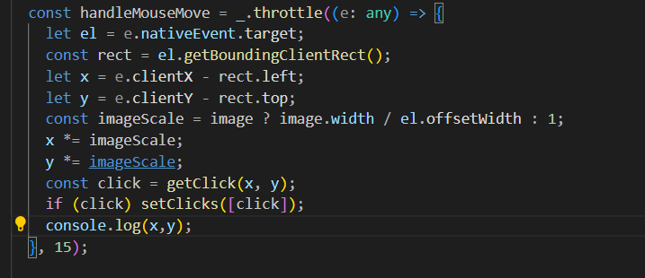
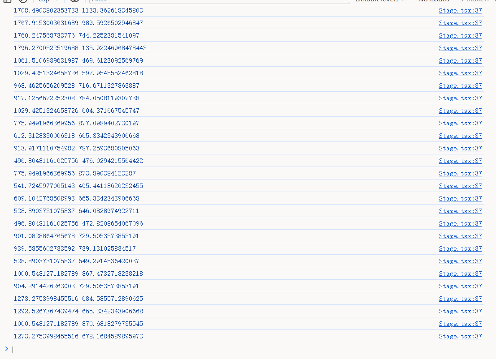
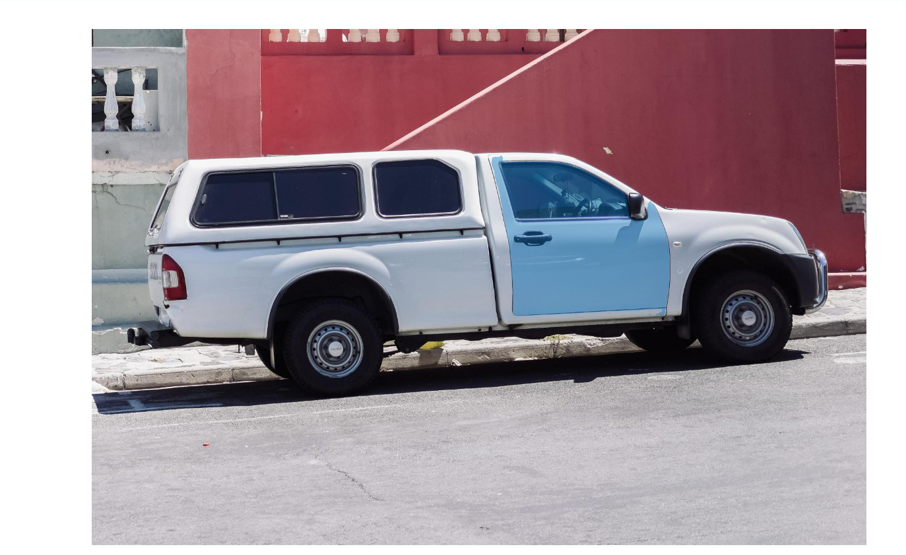

# 前端技术验证

## 前端核心需求概述

本系统采取重前端轻后端的实现框架，由于模型大小较小，所以可以使用浏览器提供的onnx运行时进行推理。

在模型推理交给前端的前提下，前端的核心需求如下

- 模型推理
- 用户多种输入捕获
- 推理结果展现与格式化

## 关键技术

最主要的关键技术为onnx运行时的调试和使用，需要验证onnxruntime-web的全套输入输出链。

以模型的推理为核心，在推理前需要获取图片的npy数据，由于npy的计算对算力要求较高，所以交由后端实现，之间传回前端。

模型的输入还有用户侧的输入，需要验证用户点击、框选两种输入模式下对于模型的调用情况。

在推理后需要对于模型的输出进行处理，一方面，需要形成mask在用户侧进行展示，另一方面，需要将数据化的结果传递给后端。

## 技术验证

### 用户侧输入验证

首先对于用户输入侧的数据捕获进行验证。由于框选可以视为捕获down和up时的不同坐标，所以与点击使用的技术相同，这里只对点击进行验证。

编写工具类监听鼠标坐标变化并在控制台输出






### onnxruntime-web

对模型的运行进行验证，运行需要指定模型、npy。为了便于技术验证，暂时将所有文件都放在本地。

编写模型的输入处理。

clicks为鼠标点击坐标，tensor为加载进来的npy文件，然后传入模型尺寸。下面的方法会输出一个模型输入用的参数。

```react

const modelData = ({ clicks, tensor, modelScale }: modeDataProps) => {
  const imageEmbedding = tensor;
  let pointCoords;
  let pointLabels;
  let pointCoordsTensor;
  let pointLabelsTensor;
  if (clicks) {
    let n = clicks.length;
    pointCoords = new Float32Array(2 * (n + 1));
    pointLabels = new Float32Array(n + 1);

    for (let i = 0; i < n; i++) {
      pointCoords[2 * i] = clicks[i].x * modelScale.samScale;
      pointCoords[2 * i + 1] = clicks[i].y * modelScale.samScale;
      pointLabels[i] = clicks[i].clickType;
    }

    pointCoords[2 * n] = 0.0;
    pointCoords[2 * n + 1] = 0.0;
    pointLabels[n] = -1.0;
    pointCoordsTensor = new Tensor("float32", pointCoords, [1, n + 1, 2]);
    pointLabelsTensor = new Tensor("float32", pointLabels, [1, n + 1]);
  }
  const imageSizeTensor = new Tensor("float32", [
    modelScale.height,
    modelScale.width,
  ]);

  if (pointCoordsTensor === undefined || pointLabelsTensor === undefined)
    return;
  const maskInput = new Tensor(
    "float32",
    new Float32Array(256 * 256),
    [1, 1, 256, 256]
  );
  const hasMaskInput = new Tensor("float32", [0]);

  return {
    image_embeddings: imageEmbedding,
    point_coords: pointCoordsTensor,
    point_labels: pointLabelsTensor,
    orig_im_size: imageSizeTensor,
    mask_input: maskInput,
    has_mask_input: hasMaskInput,
  };
};
```
然后根据捕获到的数据进行推理，模型输出是一个灰度图，需要将数组数据转化成图片数据。

```react
        const feeds = modelData({
          clicks,
          tensor,
          modelScale,
        });
        if (feeds === undefined) return;
        const results = await model.run(feeds);
        const output = results[model.outputNames[0]];
        setMaskImg(onnxMaskToImage(output.data, output.dims[2], output.dims[3]));
```

### mask图生成

模型的输出一个灰度图，需要转化成mask的图片遮罩在原图片上。下面的方法将灰度图中所有为大于0的位置全部赋予预定的蓝色。这样就形成了一层mask图的数组。然后使用imageDataToImage将数组数据转化成一张图片即可。最后将mask图遮罩在原图上。

```react
function arrayToImageData(input: any, width: number, height: number) {
  const [r, g, b, a] = [0, 114, 189, 255]; // the masks's blue color
  const arr = new Uint8ClampedArray(4 * width * height).fill(0);
  for (let i = 0; i < input.length; i++) {

    if (input[i] > 0.0) {
      arr[4 * i + 0] = r;
      arr[4 * i + 1] = g;
      arr[4 * i + 2] = b;
      arr[4 * i + 3] = a;
    }
  }
  return new ImageData(arr, height, width);
}

function imageDataToImage(imageData: ImageData) {
  const canvas = imageDataToCanvas(imageData);
  const image = new Image();
  image.src = canvas.toDataURL();
  return image;
}
```

## 验证效果

最终验证效果如下，通过点击可以传输给模型位置，模型输出的数据形成mask图后可以正确的遮盖在原图上。


